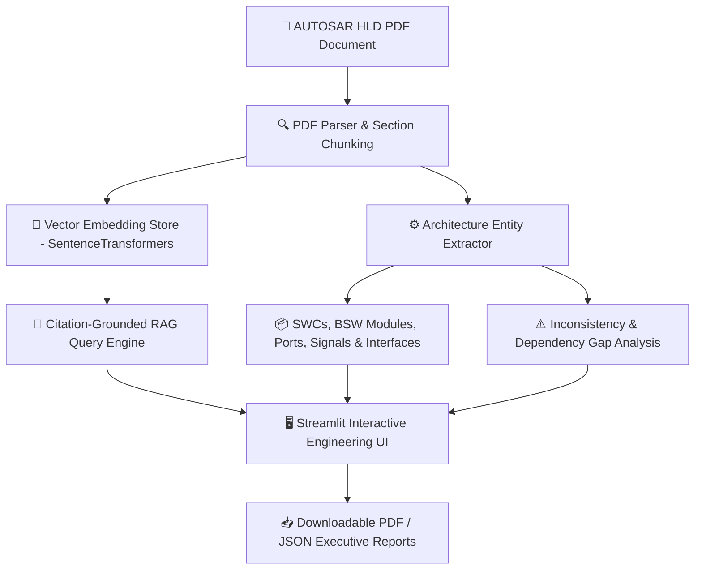

# 🚗 AUTOSAR HLD Document Analysis Assistant (Automotive AI Case Study 1)

[](https://www.python.org/)
[](https://streamlit.io/)
[]()
[]()
[](LICENSE)

An intelligent, AI-powered **AUTOSAR High-Level Design (HLD) Analysis Platform** that automates architectural knowledge extraction, component/interface mapping, RAG-based natural language Q&A with page-level citations, and design inconsistency detection.

Built as part of the **Automotive Engineering AI Case Study Series (Case Study 1: AUTOSAR HLD Document Analysis Assistant)**.

---

## 📌 Executive Summary

Automotive engineering teams spend hundreds of hours manually parsing unstructured, 100+ page HLD PDF documents to locate software components, ports, interfaces, and BSW stack dependencies. Manual review often leads to missed interface mismatches, unassigned signals, and incomplete test coverage.

This system provides:
- 📄 **Automated PDF Ingestion & Section Parsing** with page-level metadata tracking.
- 🏗️ **Architectural Entity Extraction** (SWCs, BSW modules like `EcuM`, `BswM`, `Dem`, `CanIf`, Interfaces, `PPort`/`RPort` prototypes, and Signals).
- ⚠️ **Automated Inconsistency & Gap Checker** (Detects orphan `RPort`s, missing BSW drivers, unassigned data signals, and unmapped runnables).
- 💬 **Citation-Grounded RAG Q&A Engine** providing answers backed by page and section citations.
- 📥 **Executive Report Export** (Formatted PDF reports and structured JSON specifications).

---

## 🏗️ System Architecture & Workflow



---

## 🔥 Key Features

| Feature | Description |
| :--- | :--- |
| **Section-Aware PDF Ingestion** | Extracts text page-by-page, detects section headings, and creates context-aware chunks with citation metadata. |
| **AUTOSAR Entity Recognition** | Dual Regex + LLM extraction of Application SWCs (`EngineSpeedControl_SWC`), BSW Modules (`EcuM`, `BswM`, `Com`, `CanIf`, `Dem`), Interfaces, Ports, and Signals. |
| **Design Inconsistency Checker** | Identifies orphaned Requester Ports (RPorts without matching PPorts), missing MCAL drivers, and incomplete BSW stacks. |
| **Grounded RAG Assistant** | Answers natural language questions grounded strictly in the HLD context with page numbers and snippet citations. |
| **Offline & Online Multi-LLM Support** | Works 100% out-of-the-box with a built-in Grounded Engine fallback, plus support for Google Gemini API, Groq, or Ollama. |
| **Executive PDF & JSON Exporter** | Generates audit-ready PDF reports and JSON specifications for integration into downstream tools. |

---

## 🛠️ Technology Stack

- **User Interface**: [Streamlit](https://streamlit.io/) (Dark Mode Automotive Theme)
- **Document Parser**: `pypdf`, `pdfplumber`
- **Embeddings**: `SentenceTransformers` (`all-MiniLM-L6-v2`)
- **Vector Search**: Local Cosine Similarity Vector DB / ChromaDB
- **LLM Engine**: Google Gemini API (`google-genai`), Groq, or Offline Grounded Rule-Based Engine
- **Report Generation**: `reportlab` (PDF) & `json` (Structured Specs)

---

## 🚀 Getting Started

### 1. Prerequisites
- Python 3.10 or higher
- Git

### 2. Installation

Clone the repository and install dependencies:

```bash
# Clone repository
git clone https://github.com/YOUR_USERNAME/autosar-hld-ai-assistant.git
cd autosar-hld-ai-assistant

# Create virtual environment
python -m venv .venv

# Activate virtual environment
# On Windows:
.venv\Scripts\activate
# On Linux/macOS:
source .venv/bin/activate

# Install dependencies
pip install -r requirements.txt
```

### 3. Generate Sample AUTOSAR HLD PDFs
Generate sample AUTOSAR HLD PDFs (`AUTOSAR_Engine_Control_Unit_HLD.pdf` and `AUTOSAR_Body_Control_Module_HLD.pdf`):

```bash
python generate_samples.py
```

### 4. Launch the Web Application

```bash
streamlit run app.py
```

Or on Windows, simply double-click `run_app.bat`!

---

## 📂 Project Directory Structure

```
autosar-hld-ai-assistant/
│
├── app.py                      # Streamlit Frontend Web Dashboard
├── generate_samples.py         # Sample AUTOSAR HLD PDF Generator Script
├── run_app.bat                 # 1-Click Windows Launcher Batch Script
├── requirements.txt            # Python Dependencies
├── LICENSE                     # MIT License
├── README.md                   # Project Documentation
├── .gitignore                  # Git Exclusion File
│
├── sample_documents/           # Sample AUTOSAR HLD Test PDF Documents
│   ├── AUTOSAR_Engine_Control_Unit_HLD.pdf
│   └── AUTOSAR_Body_Control_Module_HLD.pdf
│
└── src/                        # Core Application Source Modules
    ├── __init__.py
    ├── config.py               # Settings, Prompts & AUTOSAR Keyword Taxonomy
    ├── pdf_parser.py           # Page & Section-Aware PDF Extractor
    ├── extractor.py            # AUTOSAR Entity & Port/Signal Extractor
    ├── vector_store.py         # SentenceTransformers Vector Index
    ├── llm_engine.py           # Grounded RAG & LLM Provider Engine
    ├── inconsistency_checker.py# Architecture Gap & Inconsistency Analyzer
    └── report_generator.py     # PDF & JSON Executive Report Exporter
```

---

## 📝 Case Study Specification Alignment

This implementation fulfills all core requirements specified in **Case Study 1 (AUTOSAR HLD Document Analysis Assistant)**:

- ✅ PDF Ingestion & Section Metadata Extraction
- ✅ SWC, BSW Module, Port, Interface & Signal Extraction
- ✅ Grounded Q&A with Page & Section Citations
- ✅ Inconsistency & Dependency Gap Reporting
- ✅ Structured PDF & JSON Export

---

## 📜 License

Distributed under the [MIT License](LICENSE).
