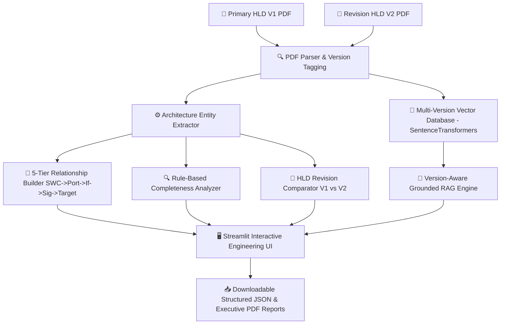

# 🚗 AUTOSAR HLD Document Analysis Assistant (Tata TechPulse Automotive AI Case Study 1)

[](https://www.python.org/)
[](https://streamlit.io/)
[]()
[]()
[](LICENSE)

An intelligent, AI-powered **AUTOSAR High-Level Design (HLD) Analysis Platform** that automates architectural knowledge extraction, 5-tier dependency mapping, rule-based completeness checks, HLD revision comparison (V1 vs V2), grounded RAG Q&A with version citations, and executive JSON/PDF report export.

Built to fulfill the required scope of **Tata TechPulse Automotive Engineering AI Case Study 1: AUTOSAR HLD Document Analysis Assistant**.

> **Note on Test Data**: Sample revision documents (e.g. `AUTOSAR_Engine_Control_Unit_HLD_V2.pdf`) are explicitly labeled as **[SAMPLE / TEST DATA FOR REVISION COMPARISON DEMONSTRATION ONLY]** and are provided solely for test and evaluation purposes.

---

## 📌 Features & Required Scope Coverage

### 1. HLD Revision / Document Comparison
- Compare two HLD document versions (e.g., HLD Version 1 vs HLD Version 2).
- Automatically identifies added, removed, and modified sections, components (SWCs), BSW stack modules, interfaces, ports, signals, and changed dependencies.
- Displays version references and page/section citations for every detected change.

### 2. Architecture Completeness Check
- Deterministic, rule-based analysis identifying missing dependencies, unmapped interfaces, missing MCAL drivers (`Can`), missing diagnostic modules (`Dcm`), state managers (`EcuM`), and unmapped signals.
- Every finding explicitly distinguishes:
  - **Evidence found in document**
  - **Detected gap**
  - **Reason for flagging**
  - **Source page/section reference**

### 3. Architecture Dependency & 5-Tier Relationship Map
- End-to-end representation of architectural relationships:
  $$\text{SWC / Component} \longrightarrow \text{Port Prototype} \longrightarrow \text{Interface} \longrightarrow \text{Signal Payload} \longrightarrow \text{Target Destination Component / BSW}$$

### 4. Component / Interface Detail Report
- Generates detailed component cards for any selected Software Component (SWC), detailing component type, bound ports, mapped interfaces, data signals, functional flows, source references, and completeness findings.

### 5. Structured Architecture Export
- Exports full structured architecture specification in JSON matching complete schema (components, BSW modules, ports, interfaces, signals, 5-tier relationships, completeness findings, revision comparison, and document version metadata).
- Preserves executive PDF export functionality.

### 6. Version-Aware RAG Assistant
- Vector store indexes version metadata tags (`V1.0`, `V2.0`).
- Multi-turn Q&A engine answers comparative questions (*"What changed in V2?"*, *"Which components were added?"*) with version and page citations.

---

## 🏗️ System Architecture



---

## 🛠️ Technology Stack

- **User Interface**: Streamlit (Dark Mode Automotive Theme)
- **PDF Parser**: `pypdf`, `pdfplumber`
- **Embeddings**: `SentenceTransformers` (`all-MiniLM-L6-v2`)
- **Vector Search**: Local Cosine Similarity Vector DB with Version Tag Filtering
- **LLM Engine**: Google Gemini API (`google-genai`), Groq, or Grounded Offline Engine
- **Report Generation**: `reportlab` (PDF) & `json` (Structured Specs)

---

## 🚀 Getting Started

### 1. Installation

```bash
# Clone repository
git clone https://github.com/YOUR_USERNAME/autosar-hld-ai-assistant.git
cd autosar-hld-ai-assistant

# Create & activate virtual environment
python -m venv .venv
.venv\Scripts\activate   # On Windows
# source .venv/bin/activate  # On Linux/macOS

# Install dependencies
pip install -r requirements.txt
```

### 2. Generate Test Sample PDFs (V1, V2, BCM)

```bash
python generate_samples.py
```

### 3. Run Unit & Feature Test Suite

```bash
python tests/test_hld_features.py
```

### 4. Launch the Application

```bash
streamlit run app.py
```
*(Or double-click `run_app.bat` on Windows)*

---

## 📂 Project Structure

```
autosar-hld-ai-assistant/
│
├── app.py                      # Streamlit Frontend Web Dashboard (7 Interactive Tabs)
├── generate_samples.py         # Sample AUTOSAR HLD PDF Generator (V1, V2, BCM)
├── run_app.bat                 # 1-Click Windows Launcher Script
├── requirements.txt            # Python Dependencies
├── LICENSE                     # MIT License
├── README.md                   # Project Documentation
├── .gitignore                  # Git Exclusion File
│
├── sample_documents/           # Sample Test PDF Documents (Explicitly Labeled)
│   ├── AUTOSAR_Engine_Control_Unit_HLD.pdf
│   ├── AUTOSAR_Engine_Control_Unit_HLD_V2.pdf
│   └── AUTOSAR_Body_Control_Module_HLD.pdf
│
├── src/                        # Core Application Source Modules
│   ├── __init__.py
│   ├── config.py               # Settings, Prompts & AUTOSAR Keyword Taxonomy
│   ├── pdf_parser.py           # Page & Section Parser with Version Metadata Tags
│   ├── extractor.py            # AUTOSAR Entity Recognition
│   ├── relationship_builder.py # 5-Tier Dependency Builder (SWC->Port->If->Sig->Target)
│   ├── completeness_analyzer.py# Rule-Based Architectural Completeness Analyzer
│   ├── comparator.py           # HLD V1 vs V2 Document Revision Comparator
│   ├── vector_store.py         # Version-Aware SentenceTransformers Vector Store
│   ├── llm_engine.py           # Version-Aware RAG Synthesis Engine
│   └── report_generator.py     # Component Detail & Structured JSON/PDF Exporter
│
└── tests/                      # Automated Feature Test Suite
    └── test_hld_features.py    # Unit & Integration Tests
```

---

## 📜 License

Distributed under the [MIT License](LICENSE).
